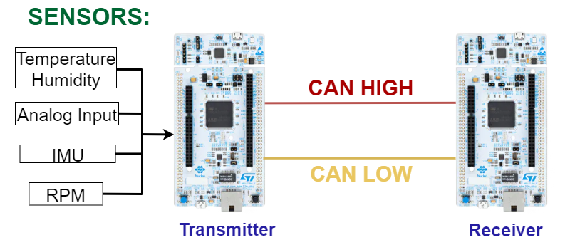

# 🚀 CAN BUS Communication in STM32 for Race Car

## 📌 Indicaciones

- Este proyecto está desarrollado en **VHDL** para FPGA.  
- Implementa un **filtro digital** como parte de un sistema embebido.  
- El código está organizado en módulos para facilitar la reutilización.  
- Incluye un **testbench** para validar el funcionamiento.  
- Compatible con herramientas como **Vivado**.  
